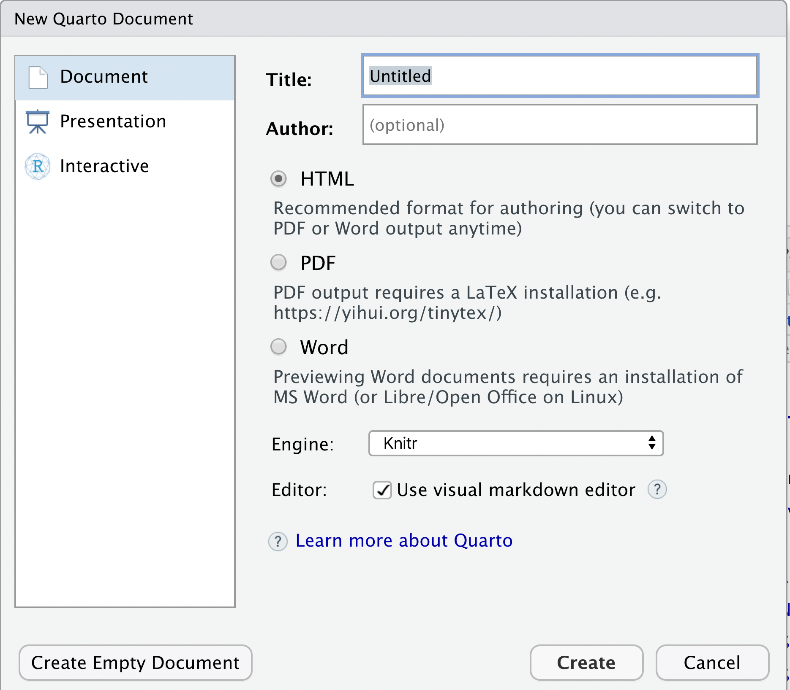

My notes on Quarto
================

# Creating a quarto project

You can start a new quarto project from scratch, but you can also
convert an existing project (markdown) to quarto.

**Note:** Make sure to have the most updated RStudio version, which will
contain full Quarto embedded.

## Creating new project

-   **On Github**

    -   Create your repository

    -   Go on code, copy the http repository path

-   **On RStudio**

    -   To clone your repository in your computer and edit on RStudio

        -   File, New Project, Version Control

            

        -   Include the http URL (or ssh if http does not work, see
            notes)

        -   Chose the path to include the project

            

        -   Done, your github repository is clone and you can edit on
            RStudio

    -   To create a new file in your repo

        -   File, New File, Quarto Document (or Quarto Presentation)

            -   Chose the file type (Pdf, WordDoc, html, PowerPoint,
                etc)

                

            -   Edit your file on Visual or source mode on RStudio

    -   Files to edit

        -   Readme - it is the file that will be shown in your github
            repository

            -   can be a front page linking to other pages within your
                repo

        -   .gitignore

            -   add files that you do not want to be tracked by git
                (either temporary files, or system files, etc)

            -   Files and directories in my standard gitignore

                    # Mac files 
                    .DS_Store

                    #Quarto files 
                    /.quarto/

                    # R files
                    .Rproj.user 
                    .Rproj.user/ 
                    .Rhistory
                    *.RData
                    *.Ruserdata

                    # conversion files (from qmd to pdf) 
                    *.tex
                    *.aux 
                    *.log

## Converting Markdown to Quarto:

-   **In the terminal**

    -   Go to local repo director, on terminal, type:

                  quarto create-project

-   Edit your \_quarto.yml file with configurations

# Updating existing files

-   **On RStudio**

    -   Update the files, save changes

    -   Mark each file to stage (add, modified, deleted)

    -   Commit changes (with message)

    -   Pull

-   **On terminal:**

    -   If you want to convert files to different formats than
        specified, inside the local repo type the following command to
        convert qmd (= quarto extension) files

            render quarto --to <format>

    -   format options include GitHub flavored markdown (gfm), docx, pdf
        (see more in the [Quarto
        userguide)](https://quarto.org/docs/computations/r.html#rendering)

# Notes of issues encountered

-   For cloning a repo: http option might not work for some setups,
    which will require the ssh option.

-   This also requires the creation of a ssh key - [see github page help
    for
    that.](https://docs.github.com/en/authentication/connecting-to-github-with-ssh/generating-a-new-ssh-key-and-adding-it-to-the-ssh-agent)
